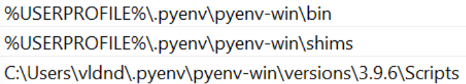
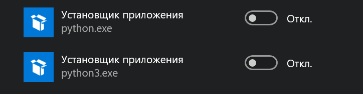

# Правильная установка python на windows
Для установки всех необходимых инструментов используется пакетный менеджер Chocolatey, при помощи которого устанавливаются:  
* pyenv - менеджер версий для python
* poetry - инструмент для управления зависимостями внутри проекта   

## **Установка Choco**  
Ставим пакетный менеджер choсo по инструкции с [официального сайта](https://chocolatey.org/install), для установки в PowerShell под администратором необходимо выполнить следующую команду:
``` PowerShell
Set-ExecutionPolicy Bypass -Scope Process -Force; [System.Net.ServicePointManager]::SecurityProtocol = [System.Net.ServicePointManager]::SecurityProtocol -bor 3072; iex ((New-Object System.Net.WebClient).DownloadString('https://community.chocolatey.org/install.ps1'))
```
## **Установка Pyenv**
Ставим pyenv по [официальной инструкции](https://pyenv-win.github.io/pyenv-win/#installation) и проверяем версию после установки

``` PowerShell
choco install pyenv-win
pyenv --version
```

Если возникли проблемы - переводим политики запуска скриптов в PowerShell в байпас для обхода ограничений безопасности

```PowerShell
Set-ExecutionPolicy -ExecutionPolicy Bypass
```

И проверяем все ли переменные среды в PATH на месте
C:\Users\user_name\.pyenv\pyenv-win\versions\3.9.6  

<p align="center">
  
</p>

После успешной установки необходимо выполнить rehash 

``` PowerShell
pyenv rehash
```
Выводим список доступных версий и ставим необходимую

``` PowerShell
pyenv install -l
pyenv install 3.9.6
```

Командой global выбрать версию питона по умолчанию

``` PowerShell
pyenv global 3.9.6
```

Заходим через поиск в пуске в управление псевдонимами(alias) и выключаем 2 установщика python  

<p align="center">
  
</p>

<!--  -->


## **Установка Poetry**
Как и с Pyenv инструкция есть на [официальном сайте](https://python-poetry.org/docs/), необходимо под администратором в PowerShell запустить следующую команду

``` PowerShell
(Invoke-WebRequest -Uri https://raw.githubusercontent.com/python-poetry/poetry/master/get-poetry.py -UseBasicParsing).Content | python -
```

Проверяем версию
```
poetry --version
```
Если не работает - добавляем вручную в PATH
```
%USERPROFILE%\.poetry\bin
```
Порядок использования 
```
poetry init
poetry install
poetry run python .\main.py
```

Добавление библиотеки mypy в основные и в dev-dependencies:
```
poetry add mypy
poetry add mypy -D
```

Удаление зависимости в в dev-dependencies и в основных происходит по тому же принципу
```
poetry remove mypy -D 
poetry remove mypy
```
